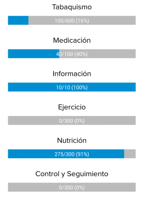

# ValueBar Widget

A simple but customizable cross-platform value/progress bar component for Appcelerator Titanium Alloy projects.



##Manifest
* Version: 1.0.0
* Github: https://github.com/mcvendrell/valueBar
* License: [Apache 2.0](http://www.apache.org/licenses/LICENSE-2.0.html)
* Author: Manuel Conde
* Supported Platforms: Android, iOS, Windows

## Adding the Widget to Your Alloy Project

* In your application's config.json file you will want to include the following line in your dependencies:

```
"dependencies": {
    "com.mcvendrell.valuebar": "1.0.0"
}
```

*  Create a widgets directory in your app directory, if it doesn't already exist.
*  Copy the com.mcvendrell.valuebar folder into your app/widgets directory. 

## Create a valuebar in the View
You can add a valuebar to a view by *requiring* the valuebar widget. 

	<Widget id="vbar1" src="com.mcvendrell.valuebar" title="My Title" />

Assign it an ID that you can use in your controller. E.g. `id="vbar1"` You can now access the valuebar via `$.vbar1` in your controller.

## Position and Style the valuebar
In your .tss file for the view, you can style and position your valuebar as you would any other view, using any valid properties for [Ti.UI.View object](http://docs.appcelerator.com/titanium/latest/#!/api/Titanium.UI.View).
Besides that, you have some "special" properties to configure the widget:

| Property | Type | Description |
| ---------- | ---- | ----------- |
| width | *number/string* | By default, width is 80% of container |
| title | *string* | Set the upper title for the bar |
| titleAlign | *string* | Alignment of title text: left|center|right |
| titleFont | *object* | Any valid font object with standart parameters (as fontFamily or fontSize) for title |
| valueColor | *string* | Hex representation of the color for filling the bar with value |
| backgroundColor | *string* | Hex representation of the color for the background bar with value |
| barHeight | *number/string* | By default, height of the bar is 20dp |
| showValuesInside | *boolean* | By default, a text with *value/total (nn%)* is shown inside the bar. You can disable it here |
| valueText | *string* | Instead automatic *value/total (nn%)*, you can set a custom text by default |
| valueTextColor | *string* | Hex representation of the color for the inside text in the bar |
| valueTextFont | *object* | Any valid font object with standart parameters (as fontFamily or fontSize) for inside value text |


```
"#vbar1": {
    width: '90%',
    valueColor: 'green',
    backgroundColor: 'red',
    showValuesInside: false
}
```

## Initializing the valuebar in the Controller

The valuebar is 0 value by default. Before you open your window, you need to call the valuebar with the *init* method to give some useful value. For example:

```
// value to show, total value
$.vbar1.init(40, 100);
```
### Initialization Parameters

| Parameter | Type | Description |
| --------- | ---- | ----------- |
| value | *number* | Value to display. |
| total | *number* | Total value for the bar. |

## Accessible Methods

Besides the initialization, you can modify the value representation and the text inside the bar for later updates

| Method | Params | Description |
| ---------- | ---- | ----------- |
| setValueText | text | Sets a new text to be shown inside the bar |
| setTotal | total | Sets a new total value for the bar |
| setVal | value | Sets a new value to fill the bar (total value is saved from init method) |

```
$.win.on('click', function() {
    $.vbar1.setTotal(60);
    $.vbar1.setValueText("50 of 60");
    $.vbar1.setVal(50);
});
```
